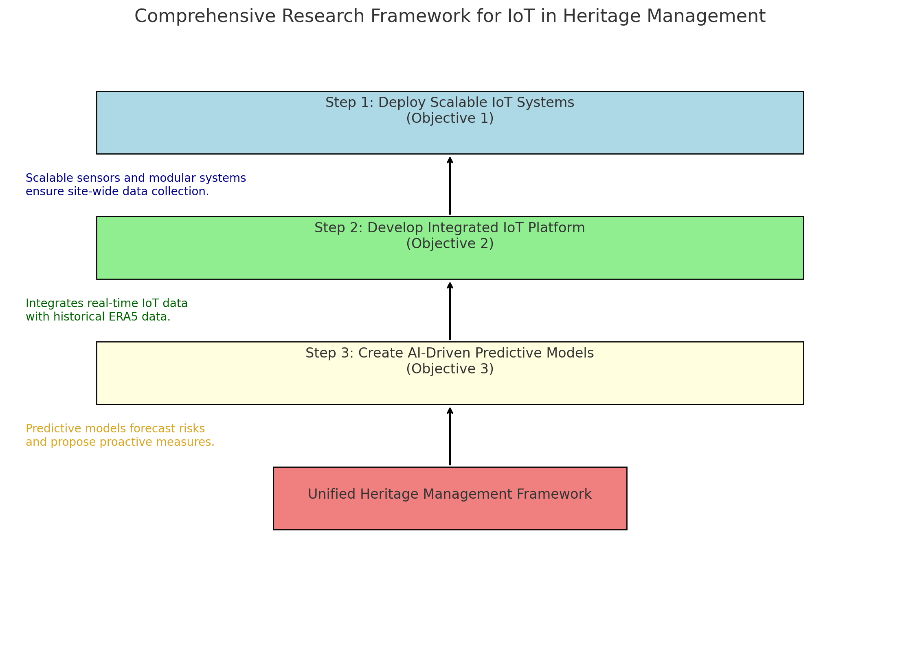

# swk-iot-heritage
### IoT Applications in Heritage Building Management and Visitor Impact Mitigation

#### Introduction

Heritage buildings represent a critical link to cultural history but are under constant threat from environmental factors and human activities, including visitor interactions. Visitors, while essential for the cultural and economic vitality of heritage sites, can contribute to wear and tear, temperature and humidity fluctuations, and other forms of degradation. The Internet of Things (IoT) offers transformative potential to monitor, analyze, and mitigate these effects in real-time, ensuring the preservation of these irreplaceable structures. Moreover, IoT technologies provide a data-driven approach to balancing accessibility with preservation, making it possible to enhance both visitor experiences and long-term sustainability.

#### Effects of Visitors on Heritage Sites

1. **Physical Wear and Tear:** High foot traffic can lead to surface abrasion, structural vibrations, and damage to delicate artifacts. This is especially problematic in sites with fragile historical elements, such as ancient mosaics or wooden flooring.
2. **Microclimatic Changes:** Human presence can increase localized temperature, humidity, and carbon dioxide levels, which may accelerate the deterioration of sensitive materials. For instance, prolonged human activity in confined spaces can create condensation, leading to mold growth or salt crystallization on surfaces. Historical microclimatic data, such as ERA5 reanalysis datasets, can be utilized to understand long-term environmental trends and inform preventive measures.
3. **Pollution:** Visitors may inadvertently introduce pollutants, including particulates from clothing and airborne contaminants such as skin flakes, deodorants, and perfumes. These pollutants can settle on artifacts, leading to gradual damage.
4. **Overcrowding:** Excessive numbers of visitors can strain structural integrity, reduce airflow, and exacerbate environmental stressors. Overcrowding can also negatively impact the quality of the visitor experience by creating congestion and reducing accessibility.

#### Existing Work Related to IoT in Heritage Sites

1. **Environmental Monitoring:**

   - IoT systems equipped with sensors are used to monitor temperature, humidity, and air quality inside heritage buildings. For example, in Malaysia, at the Stadthuys in Melaka, environmental sensors have been tested to track humidity and temperature changes to protect wooden structures and artifacts from decay. Advanced systems can also detect early signs of deterioration, such as rising damp or increased salinity levels in walls, making them invaluable for the preservation of tropical heritage sites. The inclusion of historical climate datasets like ERA5 can provide insights into seasonal variations and long-term trends affecting preservation.

2. **Visitor Flow Management:**

   - Smart cameras and motion sensors track the number and movement of visitors, enabling real-time crowd management. For instance, at the George Town UNESCO World Heritage Site in Penang, Malaysia, IoT-based monitoring systems have been proposed to manage foot traffic and protect narrow streets and historical shoplots. These systems can also provide heatmaps that highlight high-traffic areas requiring additional preservation efforts, helping site managers balance tourism with conservation.

3. **Structural Health Monitoring:**

   - IoT devices measure vibrations, cracks, and material fatigue in real time. For example, in Malaysia, initial studies at the Sultan Abdul Samad Building in Kuala Lumpur have explored sensor-based monitoring to detect structural vibrations caused by nearby traffic and urban activity. Similar efforts in ASEAN countries, such as Thailand's Wat Arun (Temple of Dawn), have utilized IoT systems to monitor the impact of environmental stressors on ancient structures. This data helps conservationists prioritize interventions and reduce restoration costs.

4. **Lighting and Energy Efficiency:**

   - Automated IoT-based systems adjust lighting and HVAC systems according to visitor presence to minimize energy use and reduce heat generation that could affect sensitive interiors. For example, at the Islamic Arts Museum Malaysia in Kuala Lumpur, motion-activated LED lighting systems are used to preserve delicate manuscripts and textiles by minimizing unnecessary light exposure. Such systems are increasingly relevant in ASEAN countries, where similar conservation techniques are applied to safeguard culturally significant artifacts.

5. **Visitor Behavior Analysis:**

   - Wearable IoT devices and mobile apps track visitor engagement and dwell time, helping managers identify areas of overuse and redistribute foot traffic. For example, at the George Town UNESCO World Heritage Site in Penang, Malaysia, similar concepts have been proposed to analyze visitor movement and enhance crowd distribution in heritage areas. Such real-time analytics have the potential to optimize visitor flow and reduce stress on high-traffic zones.

#### Potential IoT Applications for Visitor Impact Mitigation

1. **Real-time Environmental Adjustment:**

   - Deploying dynamic systems that adjust HVAC settings in response to spikes in humidity or temperature caused by visitor influx. These systems can be integrated with weather forecasts and historical climate data to preemptively manage indoor conditions.

2. **Predictive Analytics:**

   - Using IoT-generated data and machine learning to predict high-traffic periods and preemptively implement preservation measures. Predictive maintenance can also identify potential structural vulnerabilities before they become critical.

3. **Personalized Visitor Guidance:**

   - IoT-enabled apps can direct visitors to less crowded areas, enhancing the experience while protecting vulnerable sections. This technology could include augmented reality (AR) overlays to provide virtual access to restricted areas.

4. **Feedback Mechanisms:**

   - IoT devices can collect visitor feedback via interactive kiosks or mobile apps, offering insights into visitor behavior and site usage patterns. Feedback can be used to tailor conservation strategies and improve interpretive materials.

5. **Enhanced Security Systems:**

   - IoT-integrated security cameras and motion sensors can prevent unauthorized access to restricted areas and protect against vandalism or theft. These systems can also alert site managers to suspicious activities in real time.

#### Problem Statement

Despite the significant advances in IoT technologies for heritage conservation, critical gaps remain in their application to mitigate the impacts of visitors on heritage buildings. These gaps include the lack of integrated systems for comprehensive data analysis, insufficient scalability for smaller sites, and limited predictive capabilities for dynamic environmental and visitor conditions. Furthermore, ethical concerns around data privacy and technical challenges in implementing resilient IoT devices in heritage contexts hinder widespread adoption. Addressing these challenges is essential to balance accessibility with preservation effectively.

#### Research Gaps in IoT Applications for Heritage Building Management

While the existing work demonstrates the utility of IoT in monitoring and mitigating visitor impacts on heritage sites, several gaps remain unaddressed:

1. **Integration of Comprehensive Data Sources:**

   - Existing IoT systems often monitor isolated factors (e.g., environmental conditions or structural health). There is a lack of integrated platforms that combine diverse data sources (environmental, structural, and behavioral) for holistic analysis and decision-making.

2. **Scalable and Cost-Effective Solutions:**

   - Many IoT implementations are resource-intensive, making them inaccessible for smaller or less-funded heritage sites. Research into cost-effective, scalable solutions tailored to low-budget settings is needed.

3. **Dynamic Predictive Models:**

   - While predictive analytics has been applied in some cases, there is limited work on real-time, adaptive models that can dynamically adjust to fluctuating visitor impacts and environmental changes using AI.

4. **Visitor Interaction and Feedback Loops:**

   - Although visitor tracking is implemented, the integration of visitor feedback with IoT systems to optimize both conservation and visitor satisfaction remains underexplored.

5. **Privacy-Aware IoT Systems:**

   - Addressing privacy concerns is critical. Research into privacy-preserving IoT architectures and anonymized data collection methods specific to heritage contexts is still lacking.

6. **IoT Durability in Challenging Environments:**

   - Few studies focus on the long-term resilience of IoT devices in heritage sites that face extreme conditions (e.g., high humidity, dust, or temperature fluctuations).

7. **Impact Quantification:**

   - There is a lack of methodologies to quantify the direct impact of IoT interventions on the preservation and visitor experience at heritage sites, making it difficult to evaluate the return on investment.

8. **Standards for IoT in Heritage Conservation:**

   - The absence of standardized guidelines for deploying IoT in heritage contexts limits the transferability of existing solutions to new sites.

Addressing these gaps will help expand the application of IoT in heritage management and ensure that the technologies employed are effective, sustainable, and ethically sound.

#### Relating the Research to Quality of Life

1. **Preservation of Cultural Identity:**
   - Ensuring the sustainability of heritage buildings strengthens cultural identity and fosters a sense of belonging for communities, directly enhancing their quality of life.

2. **Enhanced Visitor Experiences:**
   - IoT-driven strategies, such as personalized guidance and real-time environmental adjustments, improve visitor experiences by making heritage sites more enjoyable and accessible.

3. **Healthier Environments:**
   - Monitoring and controlling environmental factors (e.g., humidity, air quality) create safer and healthier spaces for visitors and staff, reducing potential health risks.

4. **Economic Benefits:**
   - Improved heritage site management supports sustainable tourism, leading to economic growth and improved livelihoods for local communities.

5. **Community Engagement:**
   - IoT-based feedback loops empower local communities to participate in the preservation process, enhancing social cohesion and participatory governance.

#### Challenges and Limitations

1. **Data Integration:**

   - Combining data from disparate IoT devices into a cohesive framework is complex. Heritage sites may require custom solutions to integrate environmental, structural, and visitor data into a unified dashboard.

2. **Cost:**

   - High installation and maintenance costs can be prohibitive for smaller heritage sites. Funding opportunities and scalable solutions tailored to site-specific needs could alleviate this issue.

3. **Privacy Concerns:**

   - Visitor tracking through IoT raises ethical issues related to data privacy and security. Implementing anonymized data collection and adhering to strict data protection regulations are essential to mitigate these concerns.

4. **Technical Constraints:**

   - Ensuring the reliability of IoT systems in historic structures with limited electrical and network infrastructure. Wireless solutions and energy-harvesting technologies could address these constraints.

5. **Environmental Factors:**

   - IoT devices themselves must be resilient to the challenging environments of heritage sites, including extreme temperatures, dust, and humidity.

#### Methodology to Realize Objectives

**Detailed Example for Objective 1: Design Scalable IoT Systems for Smaller Heritage Sites (Muzium Islam Sarawak)**

**Scenario:**
Muzium Islam Sarawak in Kuching, Sarawak, houses historical Islamic artifacts and is a key heritage site that requires scalable IoT systems to ensure artifact preservation in a tropical climate.

- **Methodology:**
  1. **Selection of Low-Cost Sensors:**
     - Deploy DHT22 sensors for monitoring temperature and humidity to address environmental risks to delicate manuscripts and textiles.
     - Install piezoelectric vibration sensors on structural elements to detect potential stresses caused by urban activities or visitor movement.
     - Utilize energy-efficient motion sensors to optimize lighting in gallery areas.

  2. **Modular IoT Kit Development:**
     - Use open-source platforms like Raspberry Pi and Arduino to create modular kits tailored for the site’s specific requirements.
     - Implement wireless communication using LoRaWAN to handle data transmission in areas with limited network infrastructure.

  3. **Deployment:**
     - Place sensors in artifact display areas, storage rooms, and structural hotspots (e.g., ceilings and walls).
     - Equip the main gallery with IoT-enabled systems to regulate HVAC operations in response to visitor numbers and environmental conditions.

  4. **Data Collection and Storage:**
     - Store sensor data on a cloud-based platform for continuous monitoring and analysis.
     - Integrate with ERA5 historical climate data to correlate current conditions with long-term trends, enabling predictive insights.

  5. **Testing and Calibration:**
     - Conduct pilot tests for each sensor type to ensure accuracy and reliability in high-humidity and high-temperature conditions.
     - Fine-tune alert thresholds for environmental and structural monitoring based on test results.

  6. **Community Training:**
     - Train museum staff on IoT kit maintenance and data interpretation.
     - Develop user-friendly guidelines and troubleshooting manuals for on-site personnel.

**Outputs:**
- Real-time monitoring dashboard displaying temperature, humidity, and structural stress data.
- Alerts to museum staff when environmental conditions or structural integrity fall outside safe thresholds.
- Predictive insights on artifact preservation based on historical and real-time environmental data.

---

**Objective 2: Develop an integrated IoT platform combining diverse data sources.**

**Detailed Example for Objective 2: Muzium Islam Sarawak**

**Scenario:**
Muzium Islam Sarawak requires a unified platform to integrate real-time IoT sensor data with historical microclimatic data (ERA5) to identify trends and predict risks to artifacts and structures.

- **Methodology:**
  1. **IoT Sensor Integration:**
     - Deploy sensors installed under Objective 1 for environmental and structural monitoring (e.g., temperature, humidity, and vibration sensors).
     - Integrate visitor tracking devices to monitor foot traffic and its impact on microclimatic conditions within gallery spaces.

  2. **Data Collection and Harmonization:**
     - Collect real-time data from sensors and visitor tracking devices.
     - Integrate ERA5 historical microclimatic datasets into the platform to correlate long-term trends with real-time conditions.
     - Standardize all incoming data using a unified format for seamless analysis.

  3. **Cloud-Based Data Platform:**
     - Use platforms like Google Cloud IoT or AWS IoT Core for data storage and processing.
     - Design APIs to enable smooth data exchange between real-time IoT systems and the historical ERA5 dataset repository.

  4. **Visualization and Analytics:**
     - Develop a dashboard that visualizes both real-time and historical data, offering overlays of microclimatic trends and structural changes.
     - Include heatmaps to identify high-traffic zones causing environmental stress.

  5. **Predictive Alerts:**
     - Use the platform to generate automated alerts when combined data indicates thresholds are breached (e.g., high humidity or excessive vibrations).
     - Develop algorithms to provide actionable insights for artifact preservation and preventive maintenance.

  6. **Stakeholder Engagement:**
     - Provide access to the dashboard for museum staff and conservationists to make data-driven decisions.
     - Include educational materials for staff to interpret visualizations and respond effectively to alerts.

**Outputs:**
- Unified dashboard showing real-time IoT sensor data and historical microclimatic trends.
- Automated alerts for environmental and structural risks based on integrated data.
- Enhanced decision-making through data-driven insights, improving artifact preservation and visitor experience.

---

- **Methodology:**
  1. Deploy IoT sensors based on the scalable solutions from Objective 1 to monitor environmental (temperature, humidity) and structural data (vibration, crack formation).
  2. Collect historical microclimatic data from ERA5 to understand seasonal and long-term environmental trends.
  3. Develop a data integration framework using cloud-based platforms to combine real-time IoT data with historical datasets.
  4. Implement a unified dashboard for data visualization and analysis.

**Objective 3: Create AI-driven predictive models for conservation strategies.**

**Detailed Example for Objective 3: Muzium Islam Sarawak**

**Scenario:**
Muzium Islam Sarawak seeks to utilize AI to predict risks such as environmental fluctuations, structural stresses, and visitor impacts on artifacts and building integrity.

- **Methodology:**
  1. **Data Preparation:**
     - Use real-time sensor data collected under Objective 1, including temperature, humidity, and vibration measurements.
     - Incorporate visitor flow data from IoT-based tracking systems to assess patterns and their correlation with microclimatic changes.
     - Integrate ERA5 historical data to provide a baseline for long-term environmental trends.

  2. **Feature Engineering:**
     - Identify key variables, such as high humidity periods, temperature fluctuations, and visitor density, that significantly impact artifact preservation and structural integrity.
     - Generate composite indicators (e.g., combined vibration and humidity stress index) to improve predictive accuracy.

  3. **Model Development:**
     - Train machine learning models (e.g., Random Forest, Gradient Boosting) using combined datasets to predict environmental and structural risks.
     - Develop time-series models (e.g., Long Short-Term Memory networks) for forecasting future environmental and visitor impacts.

  4. **Testing and Validation:**
     - Validate models using historical incidents of artifact damage or structural wear linked to environmental conditions.
     - Test predictive accuracy using recent data collected from the museum’s IoT systems.

  5. **Integration with IoT Platform:**
     - Embed predictive models into the IoT dashboard developed in Objective 2.
     - Automate alert generation for identified risks (e.g., predicted high humidity or excessive visitor-induced vibrations).

  6. **Visualization and Reporting:**
     - Display predictive insights on the dashboard, including risk probabilities and recommended preventive measures.
     - Provide weekly reports summarizing potential risks and model accuracy metrics.

**Outputs:**
- Predictive models capable of identifying and forecasting environmental and structural risks.
- Integration of AI insights into the IoT platform for real-time decision-making.
- Enhanced preventive measures, reducing long-term degradation risks to artifacts and building structure.

---

- **Methodology:**
  1. Use combined real-time sensor data and ERA5 historical data as inputs for machine learning models.
  2. Train AI models to predict environmental fluctuations, visitor impacts, and potential risks to heritage structures.
  3. Integrate predictive models into IoT platforms for automated alerts and preventive recommendations.
  4. Test predictive capabilities in simulation environments and validate them in operational heritage sites.

**Objective 1: Design scalable IoT systems for smaller heritage sites.**

- **Methodology:**
  1. Use low-cost sensors (e.g., open-source hardware like Arduino or Raspberry Pi) for environmental and structural monitoring.
  2. Create modular IoT kits tailored for smaller-scale deployment with minimal maintenance requirements.
  3. Develop training materials and guidelines for site managers to implement and maintain the IoT systems.
  4. Pilot scalable solutions at a smaller heritage site in Malaysia (e.g., Melaka or George Town) for validation.

**Objective 2: Develop an integrated IoT platform combining diverse data sources.**

- **Methodology:**
  1. Deploy IoT sensors based on the scalable solutions from Objective 1 to monitor environmental (temperature, humidity) and structural data (vibration, crack formation).
  2. Collect historical microclimatic data from ERA5 to understand seasonal and long-term environmental trends.
  3. Develop a data integration framework using cloud-based platforms to combine real-time IoT data with historical datasets.
  4. Implement a unified dashboard for data visualization and analysis.

**Objective 3: Create AI-driven predictive models for conservation strategies.**

- **Methodology:**
  1. Use combined real-time sensor data and ERA5 historical data as inputs for machine learning models.
  2. Train AI models to predict environmental fluctuations, visitor impacts, and potential risks to heritage structures.
  3. Integrate predictive models into IoT platforms for automated alerts and preventive recommendations.
  4. Test predictive capabilities in simulation environments and validate them in operational heritage sites.

**Objective 1: Develop an integrated IoT platform combining diverse data sources.**

- **Methodology:**
  1. Deploy IoT sensors to monitor environmental (temperature, humidity) and structural data (vibration, crack formation).
  2. Collect historical microclimatic data from ERA5 to understand seasonal and long-term environmental trends.
  3. Develop a data integration framework using cloud-based platforms to combine real-time IoT data with historical datasets.
  4. Implement a unified dashboard for data visualization and analysis.

**Objective 2: Design scalable IoT systems for smaller heritage sites.**

- **Methodology:**
  1. Use low-cost sensors (e.g., open-source hardware like Arduino or Raspberry Pi) for environmental and structural monitoring.
  2. Create modular IoT kits tailored for smaller-scale deployment with minimal maintenance requirements.
  3. Develop training materials and guidelines for site managers to implement and maintain the IoT systems.
  4. Pilot scalable solutions at a smaller heritage site in Malaysia (e.g., Melaka or George Town) for validation.

**Objective 3: ********Create AI-driven predictive models for conservation strategies********.**

- **Methodology:**
  1. Use combined real-time sensor data and ERA5 historical data as inputs for machine learning models.
  2. Train AI models to predict environmental fluctuations, visitor impacts, and potential risks to heritage structures.
  3. Integrate predictive models into IoT platforms for automated alerts and preventive recommendations.
  4. Test predictive capabilities in simulation environments and validate them in operational heritage sites.

#### Research Gaps and How to Address Them

| **Research Gaps Identified**               | **Research Questions**                                                                                                                         | **Proposed Objectives**                                                                                                       | 
| ------------------------------------------ | ---------------------------------------------------------------------------------------------------------------------------------------------- | ----------------------------------------------------------------------------------------------------------------------------- |
| Integration of Comprehensive Data Sources  | How can diverse data sources (environmental, structural, and behavioral) be integrated into a unified IoT framework for heritage conservation? | Develop an integrated IoT platform that combines and analyzes heterogeneous data sources to support holistic decision-making. |       
| Scalable and Cost-Effective Solutions      | What cost-effective IoT solutions can be developed for smaller heritage sites with limited budgets?                                            | Design scalable IoT systems using affordable, modular components for low-resource heritage sites.                             |       
| Dynamic Predictive Models                  | How can real-time adaptive models predict and mitigate fluctuating visitor impacts and environmental changes?                                  | Create AI-driven predictive models to dynamically adjust conservation strategies in real-time.                                |        
| Visitor Interaction and Feedback Loops     | How can visitor feedback be seamlessly integrated into IoT systems for enhanced site management?                                               | Develop IoT-enabled feedback mechanisms to gather and integrate visitor insights for adaptive management strategies.          |       
| Privacy-Aware IoT Systems                  | What privacy-preserving techniques can ensure ethical IoT deployments in heritage conservation?                                                | Implement anonymized data collection protocols and secure architectures for IoT systems in heritage contexts.                 |       
| IoT Durability in Challenging Environments | How can IoT devices be made more durable to withstand extreme environmental conditions in heritage sites?                                      | Engineer resilient IoT hardware and systems designed to operate under extreme conditions.                                     |       
| Impact Quantification                      | How can the effectiveness of IoT interventions be quantitatively measured in heritage conservation?                                            | Establish standardized metrics and methodologies to assess the impact of IoT on preservation and visitor experience.          |       
| Standards for IoT in Heritage Conservation | What guidelines should be established for deploying IoT systems in heritage conservation contexts?                                             | Develop standardized protocols and guidelines for IoT implementation across diverse heritage sites.                           |        

#### Conclusion

IoT offers innovative solutions to monitor and mitigate the impacts of visitors on heritage sites, balancing preservation with accessibility. By leveraging real-time monitoring, predictive analytics, and dynamic systems, IoT technologies can ensure the long-term sustainability of cultural heritage. Future research should focus on integrating IoT with AI for predictive maintenance, enhancing system scalability, and addressing privacy concerns to unlock the full potential of IoT in cultural heritage conservation. Additionally, collaborative efforts between technologists, conservators, and policymakers will be crucial in overcoming implementation challenges and advancing heritage preservation methodologies.

